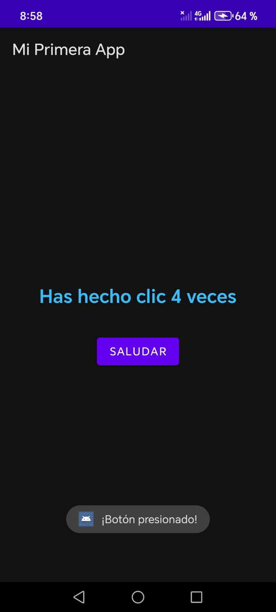
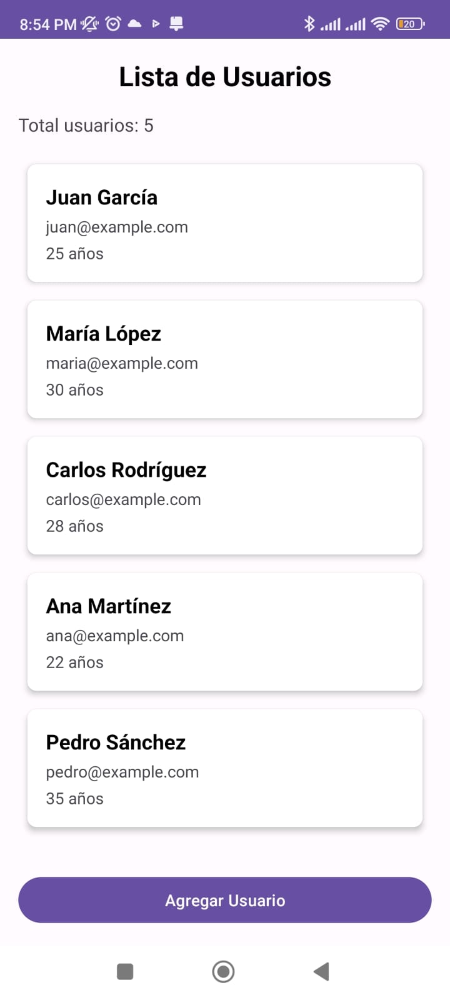
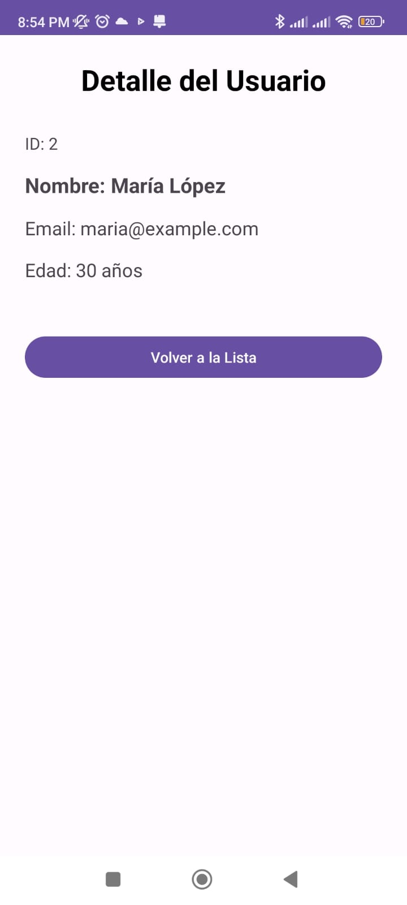

# Taller 1 & 2 Primer Corte - Desarrollo de Aplicaciones Moviles

## Información del Estudiante
- Nombre: Juan Sebastian Ropero Amado
- Grupo: E191
- Fecha: 05/03/2026

# Taller 1 - Hello Android

## Respuestas

### 1. Función del AndroidManifest.xml
El archivo AndroidManifest.xml es el archivo de configuración central de toda aplicación Android. 
Le declara al sistema operativo todo lo que necesita saber sobre la app antes de ejecutarla: 
el nombre del paquete que la identifica de forma única, todas las Activities, Services y Receivers que la componen, 
los permisos que solicita al usuario (como acceso a cámara o internet), el ícono y tema visual, 
y cuál Activity es el punto de entrada (LAUNCHER). Sin este archivo, Android no puede instalar ni ejecutar la aplicación.

### 2. Diferencia entre activity_main.xml y MainActivity.kt
Son dos capas del mismo patrón de diseño: activity_main.xml define qué se ve (la interfaz), mientras que MainActivity.kt define qué hace (la lógica). El XML describe la estructura visual usando elementos como TextView, Button y sus atributos de posición, tamaño y color. El archivo Kotlin lee esos elementos en tiempo de ejecución mediante findViewById, y les asigna comportamiento: responder a clics, actualizar texto, mostrar mensajes, etc. Esta separación entre vista y lógica hace el código más organizado y mantenible.

### 3. Gestión de recursos en Android
Android gestiona los recursos limitados del dispositivo (memoria RAM, CPU, batería) mediante un ciclo de vida controlado de las Activities. El sistema puede pausar, detener o destruir una Activity cuando necesita liberar memoria para otra tarea, notificando al desarrollador con métodos como onPause(), onStop() y onDestroy(). Además, gestiona los recursos de la app (imágenes, textos, layouts) desde la carpeta res/, separándolos del código para poder adaptarlos automáticamente a diferentes tamaños de pantalla, idiomas e configuraciones de hardware sin modificar la lógica.

### 4. Aplicaciones famosas que usan Kotlin
Netflix — usa Kotlin en su app Android para la gestión de su interfaz de streaming y personalización de contenido.
Duolingo — migró su app Android completamente a Kotlin, aprovechando las corrutinas para manejar llamadas a la red de forma eficiente.
Pinterest — adoptó Kotlin para reducir los errores de NullPointerException y mejorar la legibilidad del código de su feed visual.

## Capturas de Pantalla



---

## Taller 2 - Arquitectura MVVM, Fragments y Navigation Component
**Fecha:** 17-03-2026

### Respuestas a Preguntas Conceptuales

#### 1. ¿Qué problema resuelve el ViewModel en Android?
El ViewModel resuelve el problema de la pérdida de datos durante los cambios de configuración, como la rotación de pantalla. En Android, cada vez que se rota el dispositivo, la Activity se destruye y se vuelve a crear, lo que significa que cualquier dato almacenado directamente en ella se pierde. El ViewModel vive fuera del ciclo de vida de la Activity: cuando esta se destruye por rotación, el ViewModel permanece en memoria y los datos siguen disponibles. Además, separa la lógica de negocio de la interfaz de usuario, haciendo el código más organizado, testeable y mantenible.

#### 2. ¿Por qué LiveData es "lifecycle-aware" y qué beneficio trae?
LiveData es "lifecycle-aware" (consciente del ciclo de vida) porque sabe en qué estado se encuentra la Activity o Fragment que lo observa. Solo envía actualizaciones cuando el observador está en estado activo (STARTED o RESUMED). Esto trae dos beneficios clave: primero, evita crashes por intentar actualizar una UI que ya fue destruida (un error muy común con callbacks normales). Segundo, elimina la necesidad de cancelar manualmente los observers en onStop() o onDestroy(), ya que LiveData lo gestiona automáticamente. El resultado es menos código repetitivo y menos fugas de memoria.

#### 3. Explica con tus propias palabras el flujo de datos en MVVM
El flujo comienza en la View (Fragment): cuando interactuamos con la pantalla, por ejemplo presionando el botón, el Fragment llama a la función del ViewModel. El ViewModel recibe esa solicitud y consulta al Repository para obtener o modificar los datos, sin preocuparse de dónde vienen esos datos (pueden ser una base de datos, una API o una lista local). Una vez que el Repository devuelve la información, el ViewModel actualiza sus objetos LiveData. La View, que estaba observando ese LiveData, recibe la notificación automáticamente y actualiza la interfaz. En ningún momento la View se conecta directamente con el Repository, ni el ViewModel sabe cómo se muestra la información en pantalla. Cada capa tiene una responsabilidad única y clara.

#### 4. ¿Qué ventaja tiene usar Fragments vs múltiples Activities?
Los Fragments permiten reutilizar partes de la interfaz en diferentes contextos sin duplicar código. Una Activity puede contener múltiples Fragments y cambiar entre ellos de forma fluida con transiciones animadas, mientras que cambiar de Activity implica lanzar una nueva pantalla completa, lo cual es más pesado. Además, con el Navigation Component, toda la navegación entre Fragments se define en un único archivo (nav_graph.xml), lo que hace el flujo de la aplicación más fácil de visualizar y mantener. Otra ventaja importante es que los Fragments comparten el mismo ViewModel de la Activity, facilitando el intercambio de datos entre pantallas sin necesidad de Intents ni Bundles complejos.

#### 5. ¿Cómo ayuda el Repository Pattern a la arquitectura?
El Repository actúa como una capa de abstracción entre el ViewModel y las fuentes de datos reales. Su función principal es ocultar la complejidad del origen de los datos: el ViewModel solo llama métodos como `getAllUsers()` o `addUser()`, sin necesidad de saber si esos datos vienen de una API REST, de una base de datos Room local, de un archivo, o de una lista en memoria. Esto tiene varias ventajas: facilita cambiar la fuente de datos sin modificar el ViewModel ni la View, permite implementar caché de manera transparente, y hace el código mucho más fácil de testear porque se puede reemplazar el Repository por una versión simulada (mock) en las pruebas unitarias.

---

### Diagrama de Arquitectura

> View → ViewModel (LiveData) → Repository → Fuente de datos → Model
```
┌─────────────────────────────────────────────────────────────────┐
│                         VIEW (Fragments)                        │
│   UserListFragment  ←observa LiveData←  UserDetailFragment      │
│         │                                       │               │
│         └──────────llama funciones──────────────┘               │
└──────────────────────────┬──────────────────────────────────────┘
                           │
                           ▼
┌─────────────────────────────────────────────────────────────────┐
│                        VIEWMODEL                                │
│                      UserViewModel                              │
│   LiveData<List<User>>   LiveData<User?>   LiveData<Boolean>    │
│      (users)           (selectedUser)       (isLoading)         │
└──────────────────────────┬──────────────────────────────────────┘
                           │
                           ▼
┌─────────────────────────────────────────────────────────────────┐
│                        REPOSITORY                               │
│                      UserRepository                             │
│         getAllUsers() / addUser() / deleteUser()                │
└──────────────────────────┬──────────────────────────────────────┘
                           │
                           ▼
┌─────────────────────────────────────────────────────────────────┐
│                    FUENTE DE DATOS / MODEL                      │
│             Lista local mutable (simula BD/API)                 │
│                      data class User                            │
│                 (id, name, email, age)                          │
└─────────────────────────────────────────────────────────────────┘

  Navigation Component (nav_graph.xml + Safe Args)
  ─────────────────────────────────────────────────
  UserListFragment ──[action_list_to_detail]──► UserDetailFragment
                          userId: Int (Safe Args)
```

---

### Capturas de Pantalla



